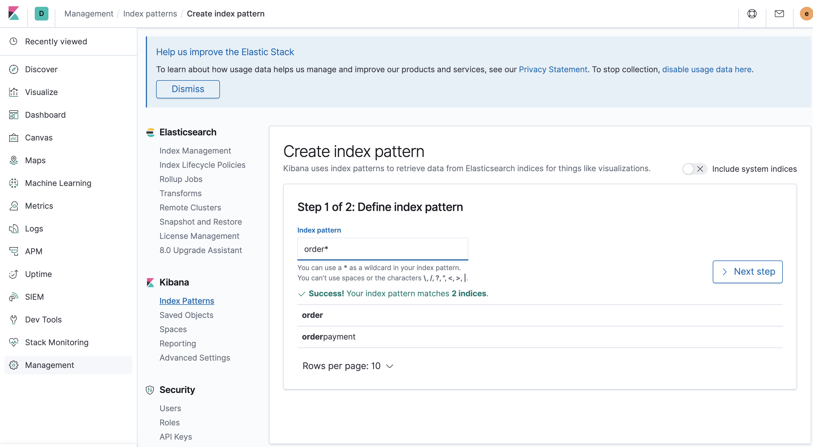
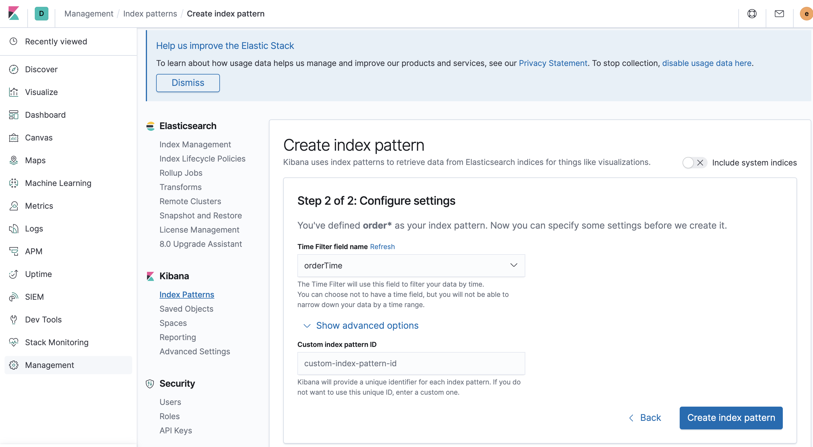
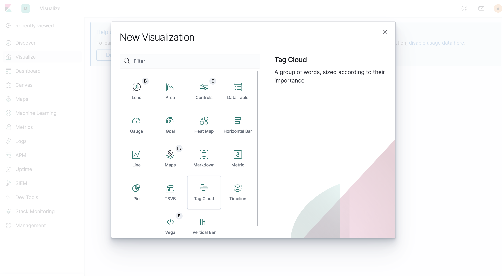
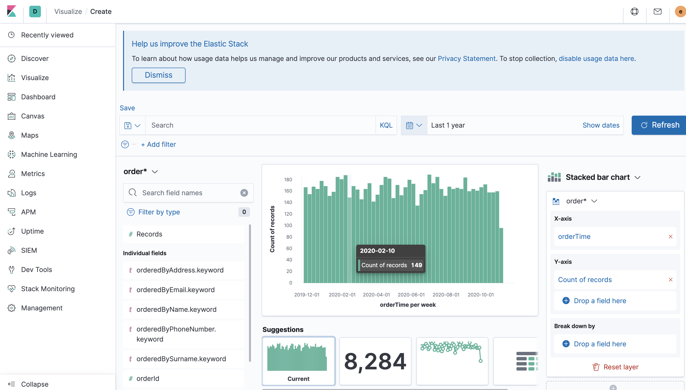
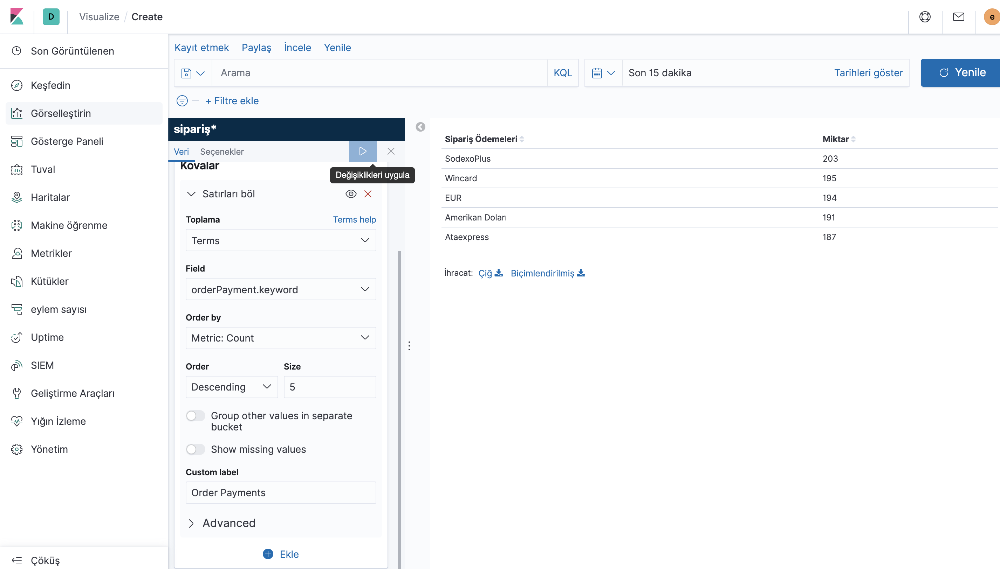
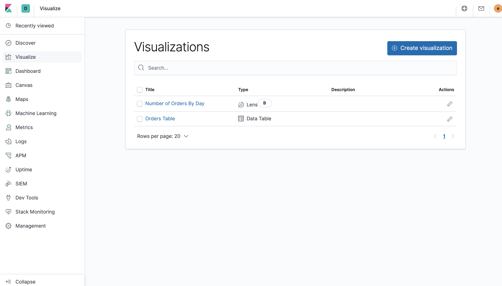
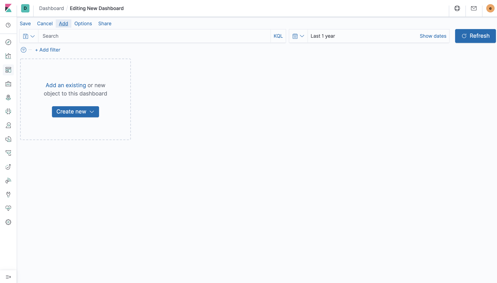
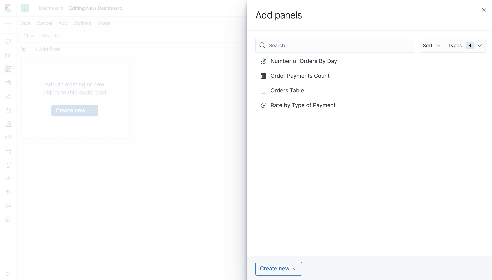
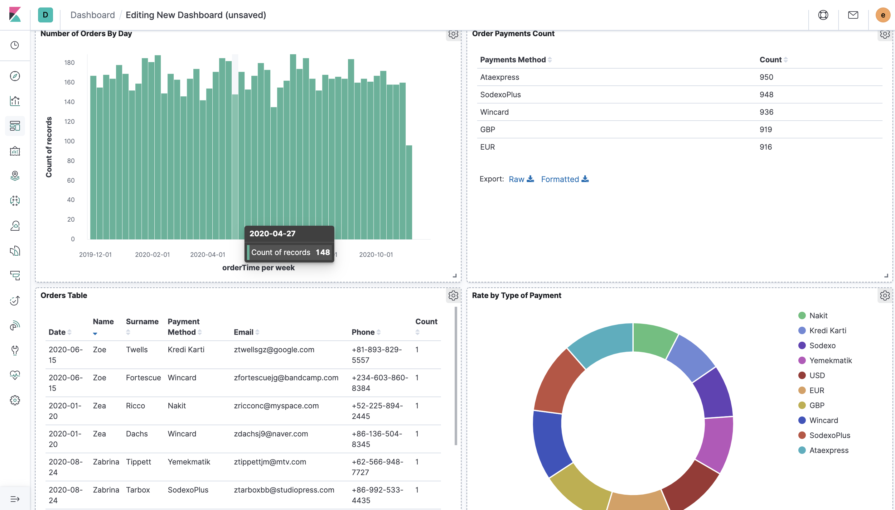

# Kibana Dashboard Oluşturma

1. Kibana default olarak 5601 portundan kalmaktadır. Eğer portu değiştirmediyseniz. 
"http://localhost:5601/" adresinde login olabilirsiniz. Login işlemi geçildikten sonra Menü'den "Management" tıklanır ve Kibana Bölümü altından "Index Pattern" seçilir.

2. Bu kısımda elasticsearch'de bulunan dökümanlar listelenir. 2 Adım sunulur. İlk olarak Dizin modeli tanımlanır. 
Aşağıda index listesi bulunur. Bir tanesi seçilip istenilen formatta yazılarak ( örn: order* ) devam edilir.
Sonraki adımda ise indexde içerisinde eğer bulunuyor ise Date ile sıralama alanınızı seçmeniz istenmektedir. 
İlerlemeden sonra dizin modeli oluşturulur.
   * Adım 1:
   
      
   * Adım 2:
   
     

1. Dizin modeli oluşturulduktan sonra Menüden "Visualize" bölümüne geçilerek "Create Visualize" butonuna tıklanır.
Bu adımda açılan "New Visualization" pop-up'dan görselleştirme yapılabilmesi için kibana tarafından sunulan modeller bulunmaktadır.
İhityacınıza uygun olarak seçilen model ile ilerlenir.
   * New Visualization
   
     
   * Add Lens
   
     
   * Payment Method List
   
     
   * List Visualizations
   
     
   
4. Seçilen modelde işelmler yazpıldıktan sonra kaydedilir.

5. Menüden "Dashboard" seçilir. Dashboard sayfasında "Create Dashboard" butonu tıklanır.

6. Açılan "Editing New Dashboard" sayfasında "add" butonuna tıklanarak.
Oluşturulan "Visualize" seçimi yapılır.
   * Create Dashboard
   
     
  
   * Add Visualize Dashboard
   
     
   
   * Example Dashboard
   
     
  
7. Dashboard'a Görselleştirmeler eklendikten sonra Save edilir ve artık kullanıma hazırdır.

